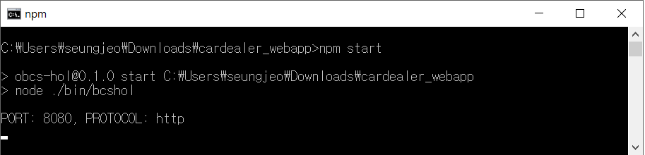

# Ledger 초기화 및 Dashboard 용 Application 준비하기

### A. Ledger 초기화

Oracle ABCS에서는 REST API를 통해 체인코드를 호출할 수 있습니다.
Transaction을 호출하는 REST API의 형식은 다음과 같습니다.
<pre><code>
POST https://RESTAPI주소/bcsgw/rest/v1/transaction/invocation 

Headers: 
Content-Type: application/json

Body: {
   "channel":"<channel_name>", 
   "chaincode":"<chaincode_name>", 
   "method":"<function_name>", 
   "args":[<arguments as an array>], 
   "chaincodeVer":"<chaincode_version>"
}
</code></pre>
이를 사용해서 샘플 Application의 데이터를 초기화하는 과정을 진행하도록 하겠습니다.

체인 코드가 업로드 되어 인스턴스화 되었으며 REST 게이트웨이를 통해 원격으로 호출 될 수 있으므로 체인 코드 기능을 호출하고 원장을 쿼리 할 수 있습니다. 원장은 현재 완전히 비어 있으므로 의미있는 데이터를 얻기 위해 장부에 샘플 데이터를 추가하도록 하겠습니다.

이번 Lab에서는 Postman툴([다운로드](https://www.getpostman.com/apps))을 통해 REST API들을 자동화해서 호출하는 방식으로 하게 됩니다.

1. 먼저 detroitauto(Founder)에서 REST Proxy주소를 복사해 둡니다. 
   아래 그림에서 가운데 붉은색으로 표시된 부분만 복사를 합니다. 
    

1. 데이터를 초기화하는 Postman 스크립트 파일은 아래의 주소에서 다운로드 합니다.

    [OBCS_Workshop.postman_collection.json](https://github.com/OracleCloudKr/Blockchain_Workshop/raw/master/CarDealerLab/artifacts/OBCS_Workshop.postman_collection.json)

    [WORKSHOP_ENV.postman_environment.json](https://github.com/OracleCloudKr/Blockchain_Workshop/raw/master/CarDealerLab/artifacts/WORKSHOP_ENV.postman_environment.json)

1. 위 2개의 json 파일 중 WORKSHOP_ENV.postman_environment.json을 여십시오.
    그 중에서 아래에 value중 굵게 표시된 부분을 각자의 환경에 맞도록 수정합니다.
    <pre>
    <code>
        {
        "key": "resturl",
        "value": "<b>xxxxxxxxxxxx</b>.blockchain.ocp.oraclecloud.com/restproxy1",
        "description": "",
        "enabled": true
        },
        {
        "key": "cloudaccount",
        "value": "<b>username@xxxx.com</b>",
        "description": "",
        "enabled": true
        },
        {
        "key": "cloudpwd",
        "value": "<b>xxxxxx</b>",
        "description": "",
        "enabled": true
        }
    </code>
    </pre>
1. 먼저 Postman을 실행한 후 import 버튼을 눌러 창을 띄우고, 위 두 개의 파일을 import 합니다.

    

1. 오른쪽 상단의 WORKSHOP_ENV 를 선택해서 환경파일을 적용합니다.
   아래 그림과 같이 OBCS_Workshop이라고 하는 Collection이 만들어지고 Http Requests들이 모두 import 된 것을 확인합니다. 이 요청들을 모두 실행하기 위해 왼쪽 상단에 있는 Runner 버튼을 누릅니다.

1. OBCS_Workshop을 선택하고, Environment에서 WORKSHOP_ENV 를 선택한 후 아래에 있는 RUN 버튼을 클릭합니다.

1. 모든 요청들이 설정한 OABCS의 Founder쪽 REST API 서버로 들어가게 됩니다.
   
   이 요청들은 샘플 App을 위하여 Ledger의 초기데이터를 적재하는 API들을 호출하게 됩니다.

# Web App에서 BlockChain 호출하기

## A. Sample Web App 배포
CarTrace 체인코드를 실행하고 기존 Ledger 내의 정보를 확인하기 위해 Dashboard 역할을 수행하는 Sample Web Application이 필요합니다.
1. 먼저 아래 링크에서 Node.js 애플리케이션을 다운로드 받으세요.

    [cardealer_webapp.zip](https://github.com/ISVOEM-KR/Blockchain_Workshop/raw/master/CarDealerLab/artifacts/cardealer_webapp.zip)

1. 다운 받은 애플리케이션을 압축 푼후 npm start를 통해 애플리케이션을 배포합니다.

## B. Blockchain Query하기

### 1. 애플리케이션에 접속합니다.

1) 앞에서 배포한 애플리케이션을 웹 브라우저를 통해 접속합니다. http://localhost:8080 혹은 http://publicIP:8080

    이 App은 제조업체인 Detroit와 파트너 업체인 Sam Dealer, Jude Dealer에서 사용하는 Vehicle Trace Dashboard 입니다. 이 App은 각각 Org의 Chaincode에 접근해서 해당 채널에 배포된 Ledger로 부터 Query를 해오고, 다른 업체로 부품을 전달하는 Transaction을 수행할 수 있는 기능을 제공합니다.
  
   딜러들은 거래를 제조업체와 공유하는 비공개 채널로 푸시합니다. "carTrace"이라는 Smart Contract(체인코드)에 의해 실행됩니다. 이 Smart Contract은 컨소시엄의 허가된 원장에 대한 모든 상태를 관할합니다. 해당 대리점의 "차량 추적 대시 보드"를 열고 포함된 부품 및 차량을 쿼리 할 때 사용하십시오.

### 2. 블럭체인에 접속하기 위한 설정을 합니다.

1) 화면 상단 우측의 아이콘을 클릭합니다.
    

1) 화면이 뜨면 다음의 내용을 자신의 환경에 맞게 입력합니다.
    - REST Proxy Endpoint : REST API 주소입니다. 이 정보는 Founder Console(DetroitAuto) 에서 확인할 수 있습니다. 
        - (예: `https://62C57E2D8944EBB48B1E6C5A28A461.blockchain.ocp.oraclecloud.com:443`)
    - Channel Name : 접속하고자 하는 채널 이름입니다. (예: **samchannel**, **judechannel**)
    - UserName : 접속 아이디 (예: **abc@oracle.com**)
    - Password : 접속 패스워드 (예: `xxxxx`)

    

1) 블럭체인의 REST Proxy에 접근하기 위한 환경을 완료하였습니다.

### 3. Sam Dealer의 채널로 접근합니다.

1) 화면 상단 우측의 아이콘을 클릭하여 Sam 이 사용하는 채널로 설정합니다.
    - REST Proxy Endpoint : 위에서 설정한 동일 REST URL을 사용합니다.
    - Channel Name : **samchannel**

    

1) 다음과 같이 제목이 samchannel 로 바뀌었음을 알 수 있습니다.

    
 

1) 다음 정보를 넣고 쿼리를 해보세요. 

    참고 : 쉼표 ","를 사용하여 쿼리 필드에서 한 번에 여러 항목을 검색 할 수 있습니다.

    에어백 일련 번호:

    | abg1234, abg1235 |
    | -- |

    차량 번호:

    | dtrt10001, dtrt10002 |
    | -- |

    위의 쿼리를 Jude Dealer의 대시 보드에서 수행하면 채널 프라이버시로 인해 결과가 조회되지 않습니다.

### 4. Jude Dealer의 채널로 접근합니다.

1) 화면 상단 우측의 아이콘을 클릭하여 Jude 이 사용하는 채널로 설정합니다.
    - REST Proxy Endpoint : 위에서 설정한 동일 REST URL을 사용합니다.
    - Channel Name : **judechannel**

    

1) 다음과 같이 제목이 judechannel 로 바뀌었음을 알 수 있습니다.

    

1) 다음 정보를 넣고 쿼리를 해보세요. 
   
    VehiclePart 일련 번호 : 

    | whl1241, win1242 | 
    | -- |

    > Detroit Auto 에서는 모든 쿼리를 실행할 수 있습니다.

2) 그리드에서 항목을 선택하면 해당 기록이 표시됩니다. 트랜잭션을 선택하면 항목의 내역 상태가 자세히 표시됩니다.

    > 참고 : 그래프에는 현재 시간보다 45 일 이내에 실행된 트랜잭션만 표시됩니다. 최근 거래를 보려면 그래프의 현재 날짜로 스크롤해야 할 수 있습니다.

    

-----

## C. Transaction 실행하기
1. 다시 Sam Dealer 채널로 설정합니다. 화면 상단 우측의 아이콘을 클릭하여 Sam 이 사용하는 채널로 설정합니다.
    - REST Proxy Endpoint : 위에서 설정한 동일 REST URL을 사용합니다.
    - Channel Name : **samchannel**

    

1. "Vehicle Trace Dashboard"를 열고 **transfer**탭을 선택하여 트랜잭션을 실행하십시오.
    **Sam Dealer**에서 **Detroit Auto**로 차량번호 **dtrt10001**를 전송해 보겠습니다.

1. 사용자 이름 **SamDealer**와 아무 비밀번호나 넣고 로그인하십시오.

    차량 번호로 **dtrt10001**을 입력하십시오(Chassis number of a vehicle). 
    
    Vehicle **new owner**로 **DetroitAuto**를 입력하십시오. 
    
    그런 다음 **Transfer Vehicle** 버튼을 클릭하십시오.

    

1. 다시 Trace 탭으로 이동해서 **dtrt10001** 를 조회해서 해당 차량의 Transaction History를 확인할 수 있습니다. 
2. 오른쪽의 API Details에서와 같이 API 호출 시에 JSON 형태로 History 데이터가 반환되는 것을 확인할 수 있습니다.

-----

## D. REST API를 통해 Transaction 실행

CarTrace의 모든 트랜잭션과 결과들은 REST API로 호출할 수 있습니다.
REST 호출을 실행할 때 두 가지 옵션이 있습니다.
- Postman과 같은 Tool 사용
- 터미널에서 "curl" 명령 사용

Postman은 앞서 기초 데이터를 넣을 때 이미 사용했습니다.
이미 배포된 곳에 Query를 위한 샘플용 request가 들어 있습니다.

1. 왼쪽 request들 가장 아래 부분에 Query Vehicle 이라는 request를 선택하십시오.

1. 오른쪽 입력파라미터 중 args로 위에서 사용한 차량번호 **dtrt10001**를 입력합니다.
    send를 누르면 결과가 차량 history에 대한 결과가 json 형태로 반환됩니다.

    위 결과는 curl 명령어를 사용해도 동일한 결과를 얻을 수 있습니다.

---
<b>수고하셨습니다. 모든 Lab 과정을 끝내셨습니다.</b>